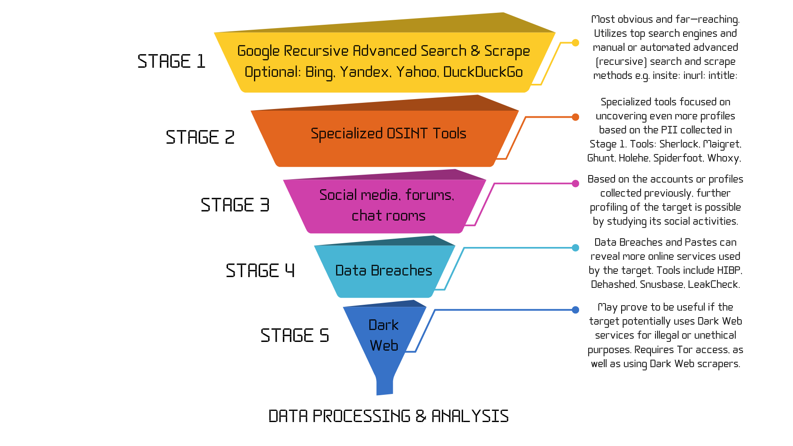

# OSINT Funnel Methodology
### **OFM - Methodology for OSINT Investigations**

**OSINT Funnel Methodology** for creating a coherent data collection workflow in person-based investigations.

## 🎯 **OFM GOAL**
The main goal of **OFM** is to provide a clear path for performing the **Data Collection** phase of an OSINT investigation, so that enough and diverse data can be passed further to the **Data Process & Analysis** phases. With hundreds of websites, services, and CLI tools available, conducting a coherent research may be overwhelming. For this reason, the OSINTer should have a clear, easy-to-follow plan for collecting data in an organized manner.

### ⚠️ **Important!**
- This methodology refers to **passive, non-intrusive OSINT tasks**.
- The mentioned tools are just examples, not an exhaustive list.
- The **OFM** methodology only addresses the **Data Collection** phase.
- The **OFM** best fits OSINT investigations related to individuals.
- Any OSINT investigations should be preceded by [**proper OpSec**](https://github.com/0SINTr/ooo).

## 🚦 **Stages**
**OFM** is meant to be followed in a **top-down approach**, starting with the widest types and methods of searching for data and gradually implementing increasingly specialized tools and techniques. In the end, all the collected data is funneled into the **Data Process & Analysis** phase.

### 🔍 **STAGE 1: Search Engines**
- The main goal of this stage is to **collect more PII** (Personal Identifiable Information, e.g., email addresses and/or usernames) about the target. The discovery of new PII is useful both for **recursively searching the web** for more data on the target, as well as **feeding this PII to specialized OSINT tools** during Stages 2-5.
- This stage may sometimes collect **the most amount of data**, although this data may be quite scattered and raw in the absence of any kind of automation or filtering algorithm.
- For each search engine, **manual** or **automated** (API-based) **advanced search and scrape** methods can be applied to filter the results via built-in operators or patterns, and also to organize the data in structured formats e.g., **JSON**.
- Furthermore, **recursive searching and scraping** should be applied for each piece of **PII** collected during previous searches. This can be done best by using an automated tool.
- The **tools** used in this stage are the most **well-known search engines**, either queried manually or programmatically:
  - [Google Advanced Search](https://www.google.com/advanced_search)
  - [Bing Advanced Search](https://support.microsoft.com/en-us/topic/advanced-search-keywords-ea595928-5d63-4a0b-9c6b-0b769865e78a)
  - [Yandex Advanced Search](https://yandex.com/support/search/query-language/search-operators.html)
  - [Yahoo Advanced Search](https://search.yahoo.com/web/advanced)
  - [DuckDuckGo Advanced Search](https://duckduckgo.com/duckduckgo-help-pages/results/syntax/)
  - [Qwant Advanced Search](https://help.qwant.com/en/docs/qwant-search/searching/comment-utiliser-les-raccourcis-de-recherche-qwick/)
  - [Startpage Advanced Search](https://support.startpage.com/hc/en-us/articles/4521473758228-Advanced-Search-on-Startpage)
  - [Baidu Advanced Search](https://www.baidu.com/gaoji/advanced.html)
  - [Naver Advanced Search](https://www.naver.com/)
  - [Internet Archive Advanced Search](https://archive.org/advancedsearch.php)

- **Automated OSINT Tool:** [**osintr *for G.R.A.S.S. - Google Recursive Advanced Search & Scrape***](https://github.com/0SINTr/osintr)

### 🛠️ **STAGE 2: Specialized Tools**
- After the first wave of (more or less) relevant data has been collected and filtered from search engines, the next step is to use **specialized OSINT tools** on the most relevant bits of data that have been collected during Stage 1 (usernames, email addresses, phone numbers, profile URLs, etc.).
- These tools are meant as additional filters for the OSINT investigation; however, they can also provide **new insights and leads** on the target's online presence. Combining these tools with the advanced searches from the previous stage may already build a significant portion of the target's **digital footprint**.
- Some of the **tools** used in this stage are:

  - **Username** search:
    - [Sherlock](https://github.com/sherlock-project/sherlock)
    - [Maigret](https://github.com/soxoj/maigret)
    - [Whatsmyname](https://whatsmyname.app/)
    - [Spiderfoot](https://github.com/smicallef/spiderfoot)
    - [Marple](https://github.com/soxoj/marple)
    - [Mailcat](https://github.com/sharsil/mailcat)
    - [Spokeo](https://www.spokeo.com/username-search)
    - [OSINT Industries](https://www.osint.industries/)
    - [IntelTechniques Username Tools](https://inteltechniques.com/tools/Username.html)
    - [Bellingcat People Toolkit](https://bellingcat.gitbook.io/toolkit/categories/people)

  - **Email** search:
    - [Holehe](https://github.com/megadose/holehe)
    - [Epieos](https://epieos.com/)
    - [Ghunt](https://github.com/mxrch/GHunt)
    - [Spiderfoot](https://github.com/smicallef/spiderfoot)
    - [theHarvester](https://github.com/laramies/theHarvester)
    - [Whoxy](https://www.whoxy.com/)
    - [Spokeo](https://www.spokeo.com/email-search)
    - [sn0int](https://github.com/kpcyrd/sn0int)
    - [Pentester](https://pentester.com/services/)
    - [OSINT Industries](https://www.osint.industries/)
    - [PredictaSearch](https://www.predictasearch.com/)
    - [IntelTechniques Email Tools](https://inteltechniques.com/tools/Email.html)
    - [Bellingcat People Toolkit](https://bellingcat.gitbook.io/toolkit/categories/people)
    - **Bonus email finders**:
        - [Snov](https://snov.io/email-finder)
        - [Experte](https://www.experte.com/email-finder)
        - [Infoga](https://www.infoga.io/)
        - [Hunter](https://hunter.io/domain-search)
        - [Minelead](https://minelead.io/)
        - [Findemail](https://findemail.io/)

  - **Phone Number** search:
    - [Spiderfoot](https://github.com/smicallef/spiderfoot)
    - [PhoneInfoga](https://github.com/sundowndev/phoneinfoga)
    - [ThatsThem](https://thatsthem.com/reverse-phone-lookup)
    - [PhoneValidator](https://www.phonevalidator.com/)
    - [Epieos](https://epieos.com/)
    - [sn0int](https://github.com/kpcyrd/sn0int)
    - [Spokeo](https://www.spokeo.com/username-search)
    - [OSINT Industries](https://www.osint.industries/)
    - [PredictaSearch](https://www.predictasearch.com/)
    - [IntelTechniques Phone Tools](https://inteltechniques.com/tools/Telephone.html)
    - [Bellingcat People Toolkit](https://bellingcat.gitbook.io/toolkit/categories/people)

### 🌐 **STAGE 3: Social Avenues**
- The information collected in the previous two steps may point to one or more **social media profiles** that the target is using. These profiles may include, but not be limited to, well-known social media services such as **Facebook**, **Instagram**, **TikTok**, **X**, or **Reddit**, secondary or emerging social networks such as **Bluesky** or **Truth Social**, blogs, forums, or chat rooms such as **Telegram**, **Discord**, **Slack**, etc.
- Any of these avenues can lead to discovering more information about the target, either **personal** (age, birthday, photos, workplace, locations, friends) or **ideological** such as political, cultural, religious, or sexual preferences, among others. Any such lead can further unravel a suite of pathways to explore, and can also help paint a better picture of the target. This research is **mostly manual**, however the **tools** below may provide additional or faster insight.

🍀 **NOTE:** There are hundreds of social media OSINT (**SOCMINT**) tools than have been developed over the years. Few of them still work (fully or partially) to this day, however most of them have not been maintained for years mostly because **social media platforms have become more restrictive** when it comes to their search functionality, API access and privacy measures. Therefore, any attempt to list all of these tools would be futile. Recently, more and more **specialized (paid) tools** emerged in the OSINT community and, even though some of them may not be affordable for most users, professional OSINT investigators will rely more and more on these solutions.

🍀 **NOTE:** In the age of information and speed, **real OSINT investigators** would rather have a handful of (paid) specialized tools to rely on anytime, in combination with other tools and APIs mentioned throughout this methodology, than spend hours or days scouring through GitHub, Reddit or other places in search of a functional tool to do their job. The purpose of the **OFM** is to provide a pragmatic and useful path for conducting OSINT investigations, not to blindly list every available tool out there.

- Below you can find some general SOCMINT search tools that are **free** or **partially free**, as well as a list of **paid** tools which is going to be updated periodically.

  - **General search tools:**
    - [IntelTechniques Facebook Search](https://inteltechniques.com/tools/Facebook.html)
    - [IntelTechniques Twitter Search](https://inteltechniques.com/tools/Twitter.html)
    - [IntelTechniques Instagram Search](https://inteltechniques.com/tools/Instagram.html)
    - [IntelTechniques LinkedIn Search](https://inteltechniques.com/tools/Linkedin.html)
    - [IntelTechniques Communities (Reddit, TikTok, etc.)](https://inteltechniques.com/tools/Communities.html)
    - [Bellingcat Facebook Tools](https://bellingcat.gitbook.io/toolkit/categories/social-media/facebook)
	  - [Bellingcat Twitter Tools](https://bellingcat.gitbook.io/toolkit/categories/social-media/twitter)
	  - [Bellingcat Instagram Tools](https://bellingcat.gitbook.io/toolkit/categories/social-media/instagram)
	  - [Bellingcat LinkedIn Tools](https://bellingcat.gitbook.io/toolkit/categories/social-media/linkedin)
	  - [Bellingcat Discord Tools](https://bellingcat.gitbook.io/toolkit/categories/social-media/discord)
	  - [Bellingcat Telegram Tools](https://bellingcat.gitbook.io/toolkit/categories/social-media/telegram)
	  - [Bellingcat Reddit Tools](https://bellingcat.gitbook.io/toolkit/categories/social-media/reddit)
	  - [Bellingcat TikTok Tools](https://bellingcat.gitbook.io/toolkit/categories/social-media/tiktok)
	  - [Bellingcat VKontakte Tools](https://bellingcat.gitbook.io/toolkit/categories/social-media/vkontakte)
	  - [Bellingcat YouTube Tools](https://bellingcat.gitbook.io/toolkit/categories/social-media/youtube)
	  - [Bellingcat Other Networks]()
	    - [SOCMINT - Others](https://bellingcat.gitbook.io/toolkit/categories/social-media/other-networks)
	    - [SOCMINT - Others](https://bellingcat.gitbook.io/toolkit/categories/social-media/multiple-networks)
	    - [SOCMINT - Others](https://bellingcat.gitbook.io/toolkit/categories/social-media/international)
  
  - **Specialized tools:**
    - [Maltego](https://www.maltego.com/search/)
    - [SocialLinks](https://sociallinks.io/)
	  - [SkopeNow](https://www.skopenow.com/)
	  - [Neotas](https://www.neotas.com/)
	  - [ShadowDragon](https://shadowdragon.io/socialnet/)
	  - [BlackDot](https://blackdotsolutions.com/social-network-analysis-tool/)
	  - [BabelStreet](https://www.babelstreet.com/solutions/osint-threat-intelligence-platform)
	  - [Spokeo](https://www.spokeo.com/)
	  - [OSINT Industries](https://www.osint.industries/)
	  - [IntelligenceX](https://intelx.io/tools)

### 🔐 **STAGE 4: Data Breaches**
- Websites and APIs providing information and search capabilities on **data breaches and pastes** can sometimes prove to be extremely rewarding, especially if the previous steps have not provided a great deal of data about the target. Finding breaches that the target's username or email address has been a part of can provide crucial clues on some of the platforms where the target has (or at least had) accounts or profiles. Furthermore, this type of search can easily be **automated** via Python scripts and libraries, at very low API costs. Of course, this can again lead to manual research once one or more pieces of data have been found.
- Typical **tools** in this step are:
  
  - [HaveIBeenPwned](https://haveibeenpwned.com/)
  - [IntelligenceX](https://intelx.io/)
  - [Dehashed](https://dehashed.com/)
  - [Snusbase](https://snusbase.com/)
  - [LeakCheck](https://leakcheck.io/)
  - [CheckLeaked](https://checkleaked.cc/)
  - [Pastebin](https://pastebin.com/)
  - [H8Mail](https://github.com/khast3x/h8mail)
  - [IntelTechniques Breaches](https://inteltechniques.com/tools/Breaches.html)
  - [IntelTechniques Pastes](https://inteltechniques.com/tools/Pastes.html)

### 🕵️ **STAGE 5: Dark Web**
- Finally, in some cases there may be a need to touch the dark web, especially if the target potentially uses this environment for **unethical or illegal activities**. Most of the time, tapping into the rabbit holes of the dark web is unnecessary since 99% of the data resides on the **clear web**. This type of research is **mostly manual**, it's done through the **Tor network** and can expose the investigator to various **risks** if proper security measures are not implemented.
- Most common Dark Web OSINT **tools** include:
  
  - [Tor Browser](https://www.torproject.org/download/)
  - [Onion Search](https://github.com/megadose/OnionSearch)
  - [Midnight Sea](https://github.com/RicYaben/midnight_sea)
  - [Darkus](https://github.com/Lucksi/Darkus)
  - [TorBot](https://github.com/DedSecInside/TorBot)
  - [GoTor](https://github.com/DedSecInside/gotor)

## 🔄 **OFM Updates**
- The **OFM may get updated over time** due to a rapidly-changing online landscape and the emergence of more sophisticated tools.
- Tools, websites, or services that are not **actively maintained** (2yrs+) will be gradually removed, and new ones will be added.

## 🍀 **Latest Updates**
- Version **v1.1.0** added **browser bookmarks** containing all the tools organized by stages, as well as a few **additional OSINT tools** - see the **bookmarks** folder.
- Version **v1.1.1** added a **report template** file containing a sample page of an OFM-based report generated during OSINT investigations - see the **template** folder.

## 📜 **Disclaimers**
- In the context of this methodology, OSINT refers to **passive, non-intrusive** open-source intelligence.
- Tool mentions are **not** endorsements. I am in **no way** affiliated with any of these tools or services.
- Not every tool mentioned here has been tested by the author of **OFM**. **Do your own due diligence!**
- Keep in mind that **any illegal or unethical use of this information is solely your responsibility**.

## 📧 Professional Collaborations

- **Email Address**:  
  Please direct your inquiries to **sintr.0@pm.me**.

- **Important Guidelines**:  
  - Use a **professional email** or a **ProtonMail** address.
  - Keep your message **concise** and written in **English**.

- **Security Notice**:  
  Emails with **links** or **attachments** will be ignored for security reasons.
